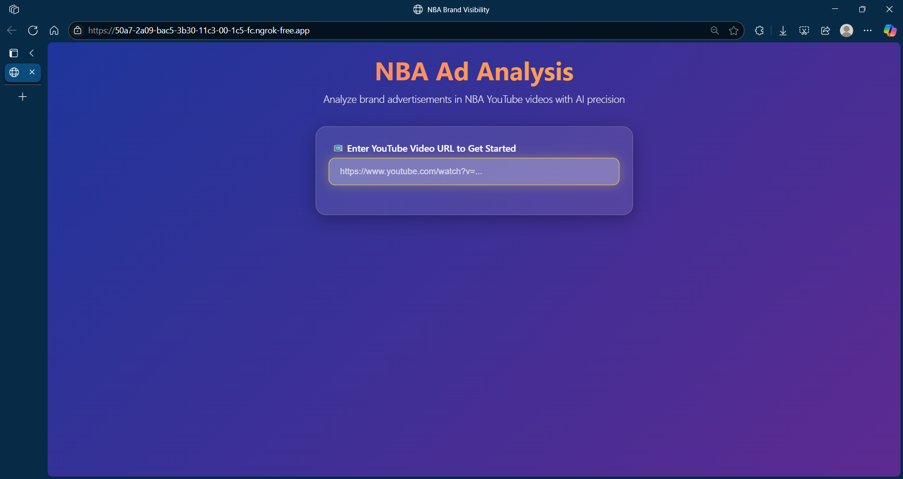
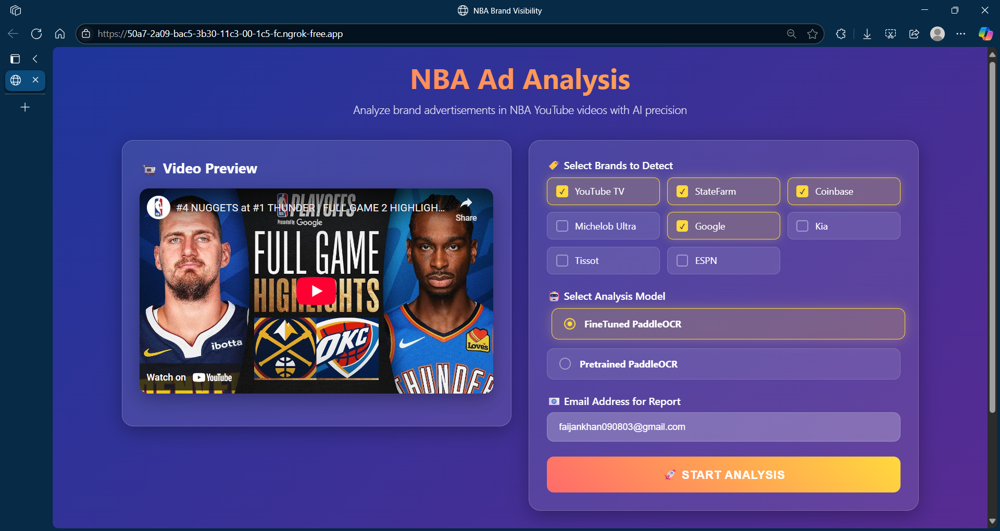
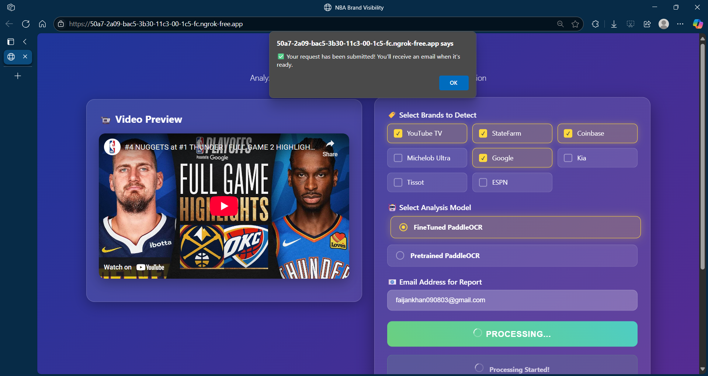
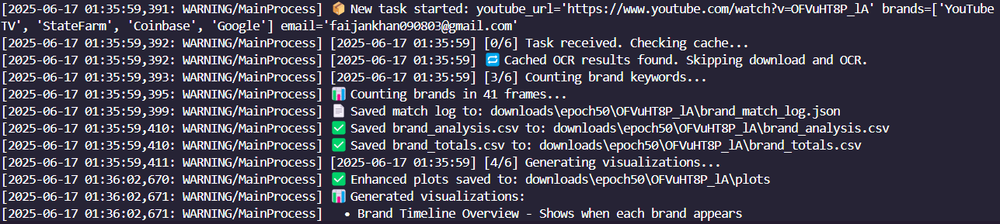
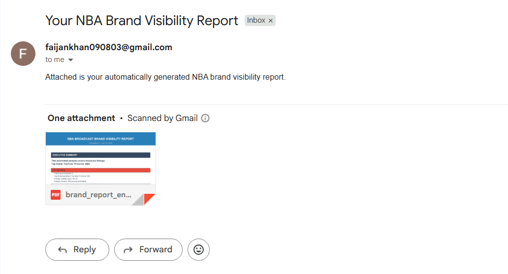

# Advertisement Analysis in NBA Videos

An end-to-end computer vision system that automatically detects and tracks brand advertisements in NBA game videos using OCR, deep learning, and asynchronous video processing. The system extracts frames from YouTube-hosted games, runs OCR to identify brand names, and generates visual PDF reports — all triggered via a user-friendly web interface.

---

## Key Features

- **YouTube Video Processing**: Download videos with `yt-dlp`
- **OCR Text Extraction**: Fine-tuned PaddleOCR for robust text detection
- **Fuzzy Matching**: Handle OCR errors via `RapidFuzz`
- **Automated Email Reporting**: PDF reports sent directly to users
- **REST API (FastAPI)**: Easily trigger video-to-report analysis via HTTP
- **Modular Pipeline**: Cleanly structured components (download, OCR, match, report)

---

## Tech Stack

| Layer         | Tools & Libraries |
|---------------|-------------------|
| Language      | Python 3.8+        |
| Video         | `yt-dlp`, `OpenCV`, `ffmpeg-python` |
| OCR Models    | `Fine-tuned PaddleOCR`, `PaddleOCR` |
| API Framework | `FastAPI`, `uvicorn` |
| Matching      | `RapidFuzz`, `fuzzywuzzy` |
| Async Engine  | `Celery`, `Redis` |
| Reports       | `email`, `Deatiled PDF` |

---

## Setup & Installation

### 1. Clone the Repository

```bash
git clone https://github.com/faijan-khan/NBA.git
```

### 2. Create a Virtual Environment

```bash
conda create --name nba python=3.10 -y
```

### 3. Install Dependencies

```bash
pip install -r requirements.txt
```


### 4. Set Email Credentials

Create a `.env` file in the root directory:

```env
SMTP_HOST=smtp.gmail.com
SMTP_PORT=desired prt
SMTP_USER=your-email@gmail.com
SMTP_PASSWORD=your-app-password
REDIS_URL=your-redis-url
```

---

## Running the App

### Start Redis server first (use wsl for windows)

```bash
wsl
redis-server
redis-cli ping
```
(you should see PONG)
### Run Celery worker (new terminal)

```bash
conda activate nba
cd backend
celery -A worker.celery_app worker --loglevel=info --pool=solo
```
### Start FastAPI server (new terminal)

```bash
conda activate nba
cd backend
uvicorn main:app --reload
```

API is available at:
`http://localhost:8000`
Interactive Docs: [`/docs`](http://localhost:8000/docs)

---
## Frontend Usage (Web UI)

The application includes a user-friendly web interface for easy interaction with the NBA advertisement detection pipeline.

### Step-by-Step UI Process

#### 1. **Access the Web Interface**
Navigate to `http://localhost:8000` in your browser to access the main interface.



#### 2. **Fill Out the Analysis Form**
- **YouTube URL**: Paste the NBA game video URL (e.g., `https://www.youtube.com/watch?v=VIDEO_ID`)
- **Email Address**: Enter your email to receive the analysis report
- **OCR Model**: Select between `fine-tuned paddleocr` or `pretrained paddleocr` for text detection
- **Brand List**: Select brands to detect (Popular brands are added)



#### 3. **Submit Analysis Request**
Click the "Start Analysis" button to trigger the pipeline processing.

#### 4. **Receive Task Confirmation**
The UI displays a confirmation message.



#### 5. **Monitor Progress** *(Optional)*
Use the task ID to check processing status via the `/result/{task_id}` endpoint.



#### 6. **Get Results**
- **Email**: Receive the PDF report directly in your inbox
- **Download**: Access the PDF report via the result endpoint when processing completes
- **CSV files**: Get the .csv files for individual as well as total brand analysis
- **Json file**: Get a .json file to see which brand is matched with which keyword



---

## Backend Process Flow

Here's how the system processes your request behind the scenes:

### 1. **Request Reception** 
```
POST /analyze → FastAPI receives form data
├── Validates required fields (URL, email, brands)
├── Generates unique timestamp
└── Creates Celery task via run_pipeline_task.delay()
```

### 2. **Task Queuing** 
```
Celery Worker picks up task
├── Task ID: a1b2c3d4-e5f6-7890-abcd-ef1234567890
├── Status: PENDING → STARTED
└── Parameters passed to pipeline_runner.py
```

### 3. **Video Processing** 
```
Pipeline Execution:
├── Download video using yt-dlp
├── Extract frames at 1 FPS using ffmpeg
├── Save frames to /downloads/model/url_id/frames/
└── Log progress to console
```

### 4. **OCR Text Detection** 
```
Text Extraction:
├── Load selected OCR model
├── Process each frame for text detection
├── Extract text coordinates and confidence scores
└── Save results to /downloads/model/url_id/paddle_ouput/
```

### 5. **Brand Matching** 
```
Fuzzy Matching Process:
├── Compare detected text against brand list
├── Use RapidFuzz for similarity scoring
├── Apply threshold filtering (e.g., >80% similarity)
├── Compile brand mentions with timestamps
└── Save results to /downloads/model/url_id/ brand_analysis.csv, brand_totals.csv, brand_match_log.json
```

### 6. **Report Generation** 
```
PDF Creation:
├── Aggregate all brand detections
├── Include frame timestamps and confidence scores
├── Generate professional PDF report
└── Save to /downloads/model/url_id/brand_report_enhanced.pdf
```

### 7. **Email Delivery** 
```
Email Service:
├── Compose professional email with results summary
├── Attach PDF report
├── Send via configured SMTP (Gmail)
└── Log delivery status
```

### 8. **Task Completion** 
```
Final Status Update:
├── Task Status: STARTED → SUCCESS
├── Save logs at /downloads/model/url_id/pipeline.log
└── Clean up temporary files (optional)
```

### 9. **Result Retrieval** 
```
GET/
├── Check task status via Celery
├── Return processing/failed/success status
├── Serve PDF file download if completed
└── Handle file not found errors
```

---
##  API Usage

### Endpoint: `POST /analyze`

#### Sample Request Body

```json
{
  "youtubeUrl": "https://www.youtube.com/watch?v=VIDEO_ID",
  "brands": ["statefarm", "coinbase", "youtubetv"],
  "email": "user@example.com",
  "model": "keras-ocr",
  "timestamp": "20250617_143000"
}
```

#### Sample Response

```json
{
  "message": "Pipeline triggered!",
  "task_id": "a1b2c3d4-e5f6-7890-abcd-ef1234567890"
}
```

### Endpoint: `GET /result/{task_id}`
```
Check the status of your analysis and download the PDF report.
```

---

## Pipeline Architecture

1. **Download Video** → `yt-dlp`
2. **Extract Frames** → `ffmpeg` (default 1 FPS)
3. **Run OCR** → `PaddleOCR or Fine-tuned PaddleOCR`
4. **Fuzzy Match Brands** → `RapidFuzz`
5. **Compile Results** → Final PDF report
6. **Email Output** → Auto-sent to user

---

## Directory Layout

```
backend
    ├── main.py 
    ├── pipeline.py 
    ├── worker.py
    ├── celery_config.py
    ├── tasks/
        ├── inference/ # Fine-tuned inferences
        ├── count.py
        ├── download_and_extract_frames.py
        ├── ocr.py
        ├── report.py
        ├── visual.py
    ├── utils/
        ├── emailer.py
frontend
    ├── index.html
    ├── style.css 
    ├── script.js
.env # Email credentials, DB configs


```

---


## Security Best Practices

* Store sensitive info in `.env`
* Sanitize YouTube links
* Add file size and video length limits
* Implement rate limiting if hosted publicly

---

## 📜 License

MIT License. See [LICENSE](LICENSE) for full details.

---

## 🙌 Acknowledgments

This project would not have been possible without the contributions and inspiration from the following open-source projects, frameworks, and individuals:

- [Keras-OCR](https://github.com/faizanvadsaria/Keras-OCR)  
- [PaddleOCR](https://github.com/PaddlePaddle/PaddleOCR)  
- [yt-dlp](https://github.com/yt-dlp/yt-dlp)  
- [FastAPI](https://fastapi.tiangolo.com/)  
- [OpenCV](https://opencv.org/)  
- [RapidFuzz](https://github.com/maxbachmann/RapidFuzz)  
- [FFmpeg](https://ffmpeg.org/)  
- [Celery](https://docs.celeryq.dev/)  
- [Redis](https://redis.io/)  
- [LabelMe](http://labelme.csail.mit.edu/)   
- [Sabudh Foundation](https://sabudh.org/)  
- Special thanks to **Mr. Bappaditya Mukhopadhyay**, **Mr. Divjot Singh**, and **Mr. Harjaspreet Singh** for guidance during the project


---

## 📬 Contact

Created by [Faijan Khan](https://github.com/faijan-khan)
📧 [faijankhan090803@gmail.com](mailto:faijankhan090803@gmail.com)

---

> ⚠️ For educational and research purposes only. Respect YouTube's TOS and copyright laws.
